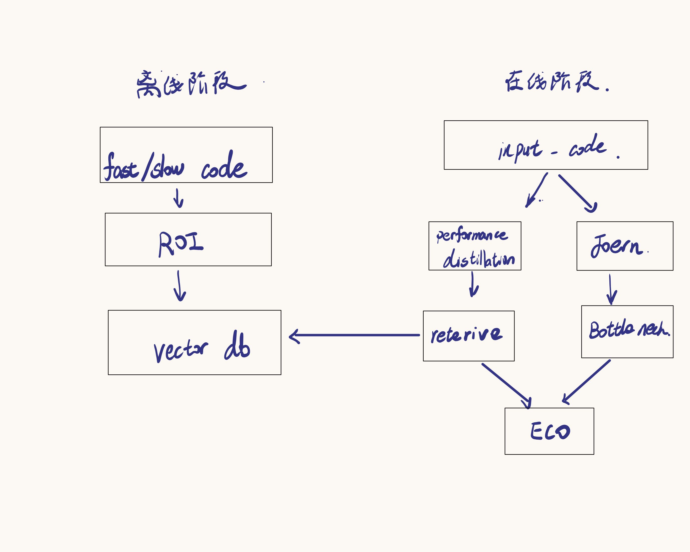
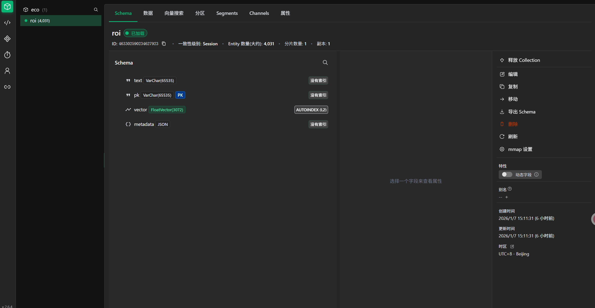
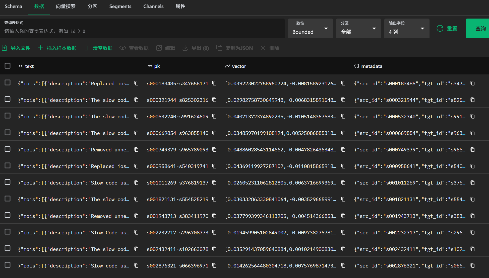
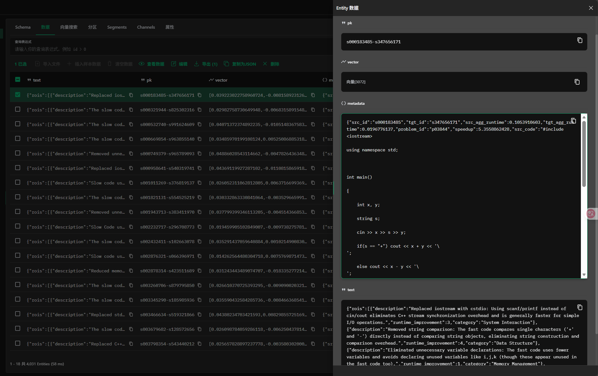

# ECO 文章复现
arXiv:2510.10517v1

# Pie HQ
https://drive.google.com/drive/folders/1E_yFqM8khN1HAH03OKhjheSlNI4rYTT7
[preprocess.py](eco%2Fdata%2Fpreprocess.py)

# 离线阶段
生成ROI  
[ROIdistillation.py](eco%2Fagents%2FROIdistillation.py)  
数据集的向量导入到milvus  
[import_roi_to_vdb.py](eco%2Fimport_roi_to_vdb.py)

# 在线阶段
代码的性能感知描述->检索ROI   
[ROIRetriever.py](eco%2Fagents%2FROIRetriever.py)  
Joern定位瓶颈  
[ECOAgent.py](eco%2Fagents%2FECOAgent.py)